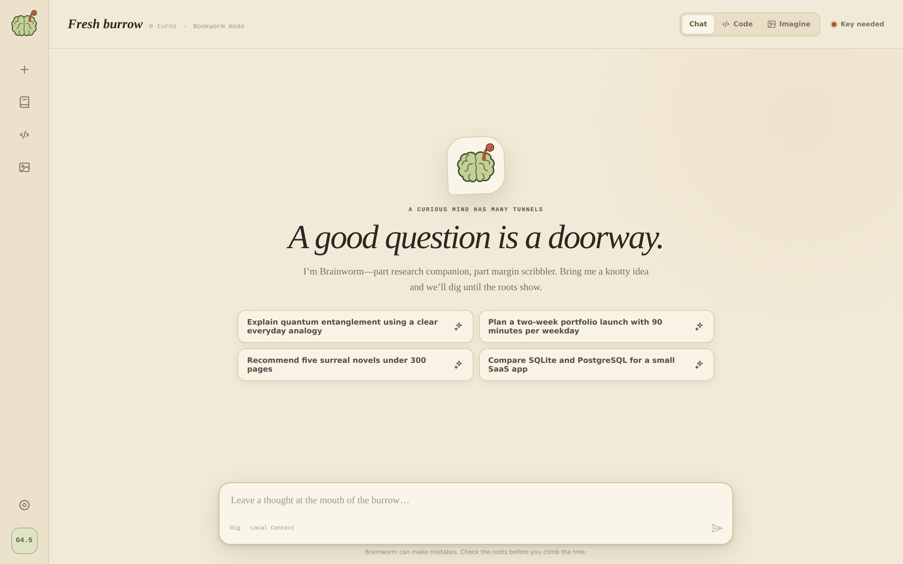
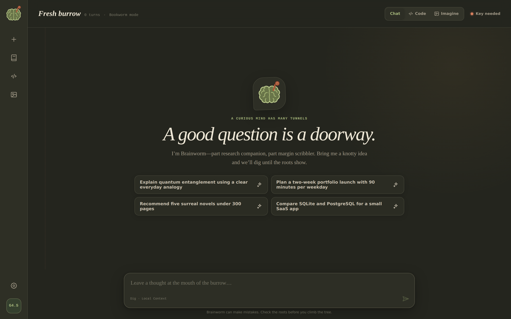
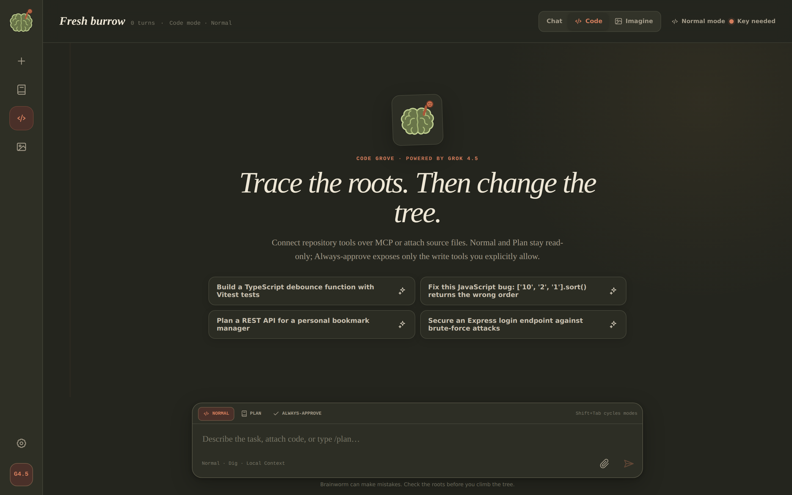
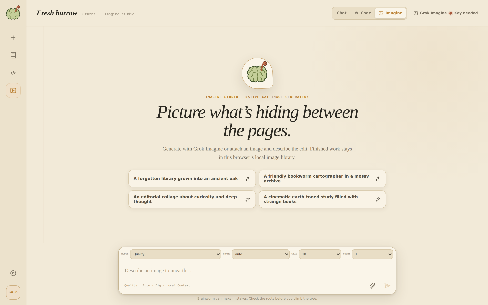
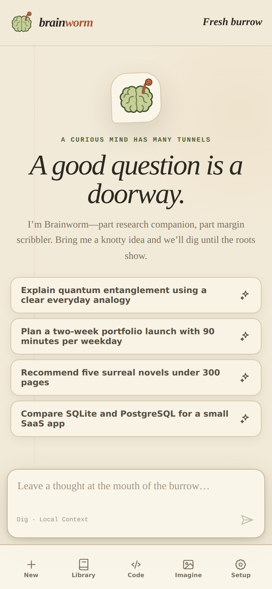

<div align="center">
  

# Brainworm

**A bookish, earth-toned workspace for xAI's Grok — part research companion, part margin scribbler.**

Bring your own xAI API key and dig in.

</div>

---

Brainworm is a Next.js app with three native xAI workspaces wrapped in a compact rail, a browser-local thread library, and a manuscript-like feed:

- 📖 **Chat** — streamed Grok 4.5 responses with reasoning effort, native web search, citation breadcrumbs, reply regeneration and branching, and xAI text-to-speech.
- 🌿 **Code** — Normal, Plan, and Always-approve session modes, attached source context, user-configured HTTPS MCP workspaces, structured tool activity, and plan approval before implementation.
- 🎨 **Imagine** — Grok Imagine generation and editing with fast or quality models, aspect ratios, 1K/2K output, and a local image library.

## Screenshots

|                                 Chat · Parchment                                  |                               Chat · Night soil                               |
| :-------------------------------------------------------------------------------: | :---------------------------------------------------------------------------: |
|  |  |

|                                     Code grove · Night soil                                      |                               Imagine studio · Parchment                                |
| :----------------------------------------------------------------------------------------------: | :-------------------------------------------------------------------------------------: |
|  |  |

<p align="center">
  
  &nbsp;&nbsp;
  
</p>

## Getting started

Requires Node.js 22 or newer (`.nvmrc` is included).

```bash
npm install
npm run dev
```

Open Settings → Model and enter your xAI API key. The same key powers Responses, TTS, voice discovery, and Imagine, and usage is billed to the xAI account that owns it. `XAI_MODEL` is an optional server environment variable and defaults to `grok-4.5`.

Prefer a container? The production image uses Next.js standalone output, runs unprivileged, and exposes `/api/health` as its health check:

```bash
cp .env.example .env.local
docker compose up --build
```

**On your phone:** visit the deployed site (e.g. the Vercel deployment) in Chrome and choose **⋮ → Add to Home screen** to install Brainworm as a mobile web app. On iPhone, use **Share → Add to Home Screen** in Safari or Chrome.

## Privacy

Everything personal stays in the browser. Your xAI key, threads, settings, and MCP definitions live in `localStorage`; generated images live in IndexedDB; voice clips live in the Cache API. Credentials are sent only to Brainworm's same-origin API routes, which forward them to xAI for that request without persisting them, and chat requests use `store: false`.

## Safety and intended use

Brainworm is a creative and technical tool. It is **not intended for children** and must not be used as a companion, friend, therapist, caregiver, or romantic partner. AI output can be inaccurate, unsafe, or inappropriate; never rely on Brainworm for crisis response, professional advice, or safety-critical decisions.

Read the [AI Output Disclaimer and Conditions of Use](docs/ai-output-disclaimer.md) and [Not a Companion](docs/not-a-companion.md) policy before using or deploying the app. The [documentation index](docs/README.md) summarizes these boundaries.

## MCP workspaces

Add up to eight remote HTTPS MCP servers under Settings → Workspaces. Each server has two exact tool allowlists:

- **Read-only tools** are exposed in Normal and Plan modes.
- **Always-approve tools** are exposed only after you select Always-approve or approve a plan for implementation.

An empty allowlist exposes no tools. Server labels are normalized and deduplicated, insecure URLs are rejected, and authorization headers stay browser-local between requests.

## Development

```bash
npm run check   # format:check + lint + typecheck + test:coverage
```

`npm run format` and `npm run lint:fix` apply safe automated fixes; GitHub Actions repeats the same quality gate on every pull request.

## References

- Darkwords — product structure and responsive interaction reference
- Wordmark — xAI TTS and Grok Imagine behavior reference
- [xAI Grok Build](https://github.com/xai-org/grok-build) — agent modes, plan approval, tool visibility, sessions, and permission workflow reference (Apache-2.0)
- [xAI Responses API](https://docs.x.ai/developers/model-capabilities/text/generate-text) · [Text to Speech](https://docs.x.ai/developers/model-capabilities/audio/text-to-speech) · [Image Generation](https://docs.x.ai/developers/model-capabilities/images/generation) · [Remote MCP](https://docs.x.ai/developers/tools/remote-mcp)

---

<p align="center"><sub>Created with GPT-5.6 Sol · extra high · fast</sub></p>
